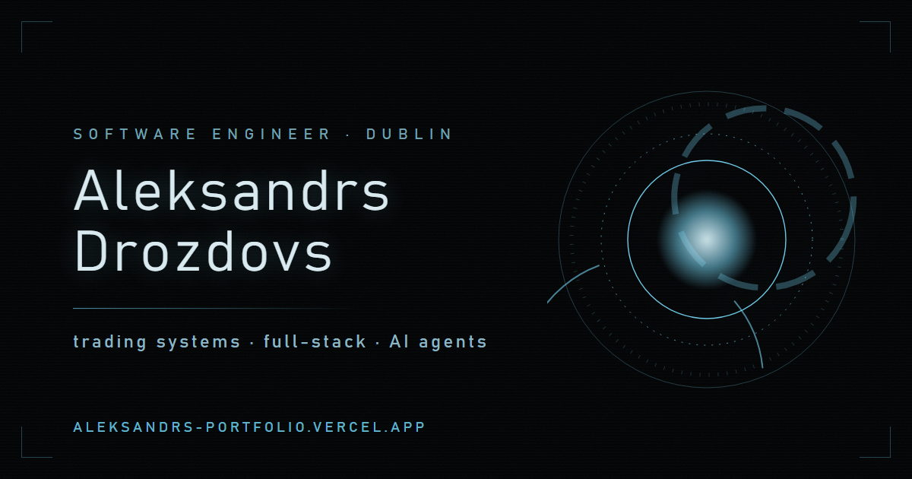

# Aleksandrs Drozdovs Portfolio



[](https://github.com/aleks-drozy/aleksandrs-portfolio/actions/workflows/ci.yml)

Personal portfolio for graduate software engineering, full-stack, data tooling, and quantitative developer roles.

Live at: [aleksandrs-portfolio.vercel.app](https://aleksandrs-portfolio.vercel.app)

## Positioning

The site presents Aleksandrs as a Dublin-based Computer Science and Software Engineering graduate from Maynooth (2026) with a practical SWE plus quant angle. The hero pairs three proof metrics with `Fig. 01`, the in-sample equity curve of the final-year NASDAQ-100 strategy. Beneath it, six exhibits carry the argument: the Dublin Bikes Forecast, JARVIS, Personal Performance OS, Maken, the NASDAQ-100 FYP strategy, and the pre-registered research program that put that strategy on trial and disproved its edge.

## Stack

- **Framework:** Next.js 16 App Router
- **Language:** TypeScript
- **Styling:** Tailwind CSS v4 with a hex token set declared in a `@theme` block (`src/app/globals.css`)
- **Type:** Fraunces (serif), Geist Sans, Geist Mono
- **Motion:** Framer Motion
- **Charts:** hand-rolled SVG — `src/components/EquityCurve.tsx`, no charting library
- **Testing:** Vitest, Testing Library, jsdom
- **Deployment:** Vercel

## Main Routes

- `/` - portfolio homepage

Every case study is statically generated from the slugs in `src/lib/case-studies.ts`:

- `/projects/jarvis` - voice-controlled AI assistant and unattended agent pipeline
- `/projects/personal-performance-os` - full-stack training, food, habits, and tasks SaaS
- `/projects/maken` - AI weight-cut SaaS for judo and BJJ athletes
- `/projects/fyp-trading-strategy` - final-year NASDAQ-100 trading strategy
- `/projects/fyp-strategy-engine` - six-phase pre-registered quant research program
- `/projects/monte-carlo-robustness` - Monte Carlo stress test of a real 72-trade record
- `/projects/polymarket-favourite-bias` - pre-registered backtest of Polymarket favourites
- `/projects/dublin-bikes-forecast` - live self-scoring bike availability forecasting service
- `/projects/football-trajectory` - Monte Carlo projection of young footballers' careers
- `/projects/speed-to-lead` - AI receptionist that qualifies and books inbound leads
- `/projects/trading-dashboard` - full-stack trade journal and market-research app
- `/projects/backtest-engine` - Python backtesting infrastructure and strategy comparison
- `/projects/noteit` - full-stack note-taking project

## Homepage Sections

- **Hero** - status, headline, lede, three proof metrics, CV download, and the `Fig. 01` equity curve
- **Selected work** (`#work`) - six exhibits (`Fig. 02` to `Fig. 07`), then seven "Also shipped" cards; all thirteen link to a case study
- **Track record** (`#experience`) - DLT Capital and part-time roles beside the Maynooth degree, coursework, and certifications
- **Toolbox** (`#skills`) - languages, frameworks, AI and ML, testing and tools
- **Character** (`#character`) - judo and algorithmic trading
- **Contact** (`#contact`) - email, LinkedIn, GitHub, CV

## Design Specs

Design specs for each iteration of the site live in `docs/specs/`:

- `2026-04-17-portfolio-redesign.md`
- `2026-04-18-backtest-engine.md`
- `2026-06-02-portfolio-flagship-update.md`
- `2026-07-11-portfolio-redesign.md`

## Running Locally

```bash
npm install
npm run dev
```

Open [http://localhost:3000](http://localhost:3000).

## Verification

```bash
npm run lint
npm run test:run
npm run build
```
